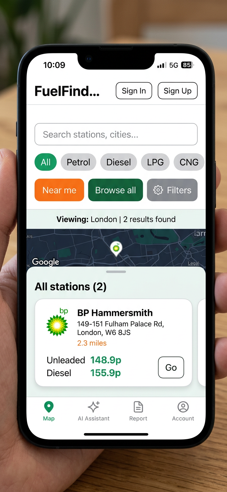
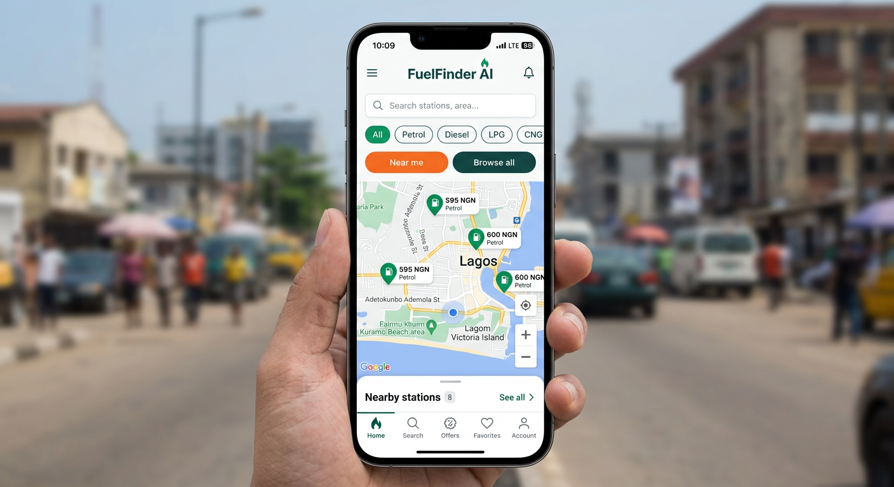
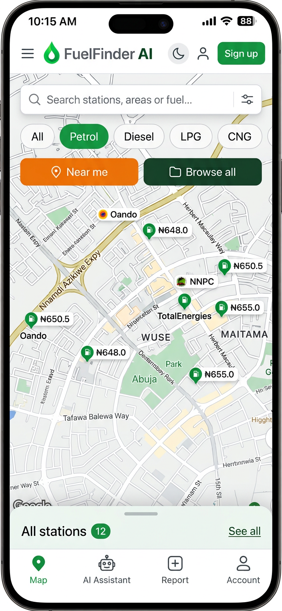
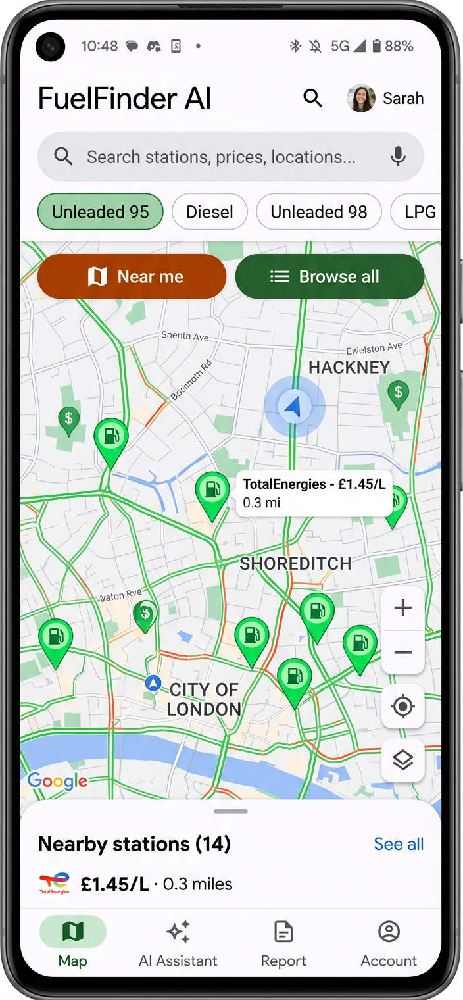
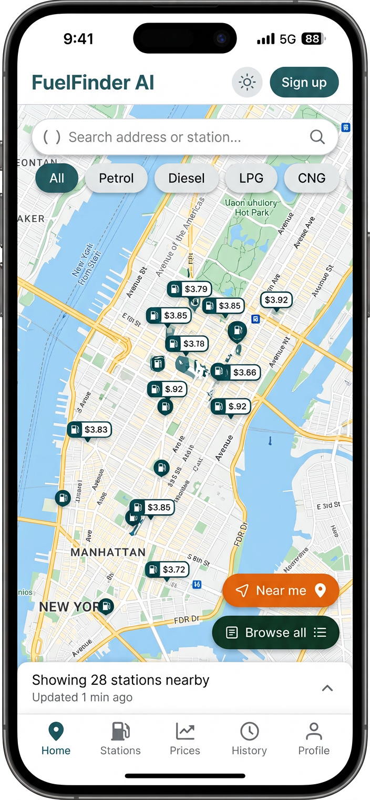
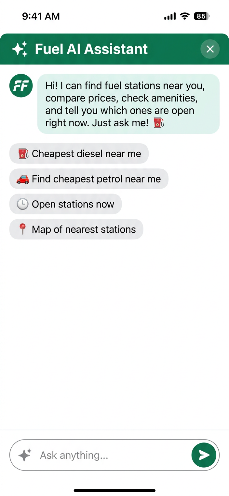
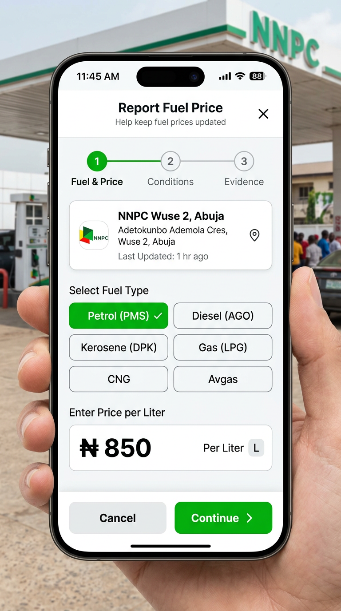
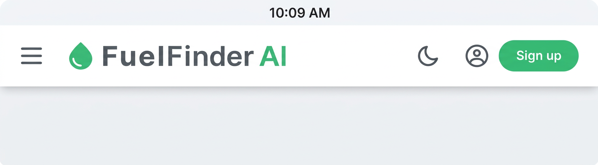

# FuelFinder AI — mobile UI refactor

Date: 2026-08-18 · Scope: **frontend layout / density only**.

This is a UI/UX refactor. Every working feature was treated as production-critical.

## Confirmations

| Check | Result |
| --- | --- |
| Existing functionality preserved | **Yes** |
| Business logic changed | **No** |
| API contracts changed | **No** |
| Database / env / auth / Gemini / Groq / Supabase changed | **No** |
| Report, search, map, geolocation, admin flows changed | **No** |
| Existing tests | **552 / 552 passed** (48 files) |
| `tsc --noEmit` | **clean** |

The map still mounts once. Filters still write to `useMapStore`. AI still goes through `requestAiRecommendation`. Report still posts one multipart request. Location still belongs to the store.

---

## Files changed

| File | What changed |
| --- | --- |
| `frontend/src/app/page.tsx` | Map-first overlay chrome; peek sheet is a summary; AI / Report / Account are full-viewport pages on mobile |
| `frontend/src/components/ui/Sheet.tsx` | New `FullPage` surface; collapsed sheet 16% / 14% short; tighter grabber |
| `frontend/src/app/globals.css` | `.h-page` (`100vh` / `100dvh`) for full-screen mobile pages |
| `frontend/src/components/search/SearchBar.tsx` | Optional `compact` density for the map overlay |
| `frontend/src/components/stations/FuelFilterChips.tsx` | Optional `compact` shorter pills |
| `frontend/src/components/stations/StationFilters.tsx` | Compact tracking row uses `xs` / `icon-sm` |
| `frontend/src/components/shell/AppHeader.tsx` | Brand never truncates; Sign in is icon-only on narrow phones |
| `frontend/src/components/ai/FuelIntelligence.tsx` | `fullScreen` variant fills the viewport (same prompts, history, API) |
| `frontend/src/components/account/AccountPanel.tsx` | Close control; wrapping copy for longer locales; clearer hierarchy |
| `frontend/src/app/about/page.tsx` | Full-page reading density; header brand no longer truncates |
| `frontend/tailwind.config.ts` | `shorty:` comment updated to the new overlay model |
| `docs/DESIGN_SYSTEM.md` | Home layout contract (overlay chrome + 16/52/92 snaps) |

No backend, API, store, hook, or schema files were touched.

---

## What changed, and why

### 1. Map is the primary surface

**Before:** search + chips + tracking controls sat *above* the map and consumed ~230 px. Combined with a 42% peek sheet, visible map was ~37–40% of the phone.

**After:** those controls are absolutely positioned over the map (Google Maps / Uber / Bolt pattern). They keep the same document order (`header → search → chips → Near me → map → nav`) so existing tests still hold, but they no longer push the map down.

Collapsed sheet is now a **summary** (handle + title + count + “See all”), not a card. Snap heights:

| Snap | Before | After |
| --- | --- | --- |
| peek | 42% (34% short) | **16%** (14% short) |
| half | 68% | **52%** |
| full | 92% | 92% |

Map floating controls stay locked to the same percentages.

Target on a typical 800 px-tall phone: **~60–70% map, ~30–40% chrome**.

### 2. Compact, still tappable controls

- Search field: 40 px on mobile overlay (was 48)
- Fuel chips: 32 px pills, less horizontal padding (was 36 + `min-h-touch`)
- Near me / Browse all / Filters: `xs` (32 px visual). Icon-only locate / favourites stay labelled for assistive tech
- Overlay padding dropped from 12–16 px to 10 px

Chip hit area stays above WCAG 2.5.8 (24 px). Named actions remain 32 px+ and horizontally generous.

### 3. AI Assistant is a full-page screen

Mobile no longer opens a 92 vh rounded modal. `FullPage` occupies `100vh` / `100dvh`.

Preserved: suggested prompts, chat transcript, Groq request path, streaming/loading, location honesty, `data-testid="fuel-intelligence"`, close label, `role="dialog"` so existing nav tests still address it.

### 4. Report is a full-page screen

Same 3-step form, photo staging, validation, and single multipart submit. On mobile it fills the viewport; desktop keeps the centred modal.

### 5. About is a full-page route

Already `/about`. Mobile padding and the sticky header were tightened so the page reads as a document, not a card. Brand no longer truncates. All sections, honesty rules, and contact links are unchanged.

### 6. Header does not cut off the brand

At 360 px: hamburger + glyph + **full “FuelFinder AI”** + theme + icon Sign in + compact “Sign up”.

Sign in / Sign up still do the same things. Accessible names stay on the buttons.

### 7. Account

Full-viewport page on mobile (drawer on desktop). Added an explicit close control (no scrim on a full page). Row titles wrap so Hausa / Yoruba / Igbo strings will not clip.

---

## Screenshots

These are annotated layout mockups of the intended density (this environment has no headed Chromium, so they are not pixel captures of the running build). The live app is the source of truth — open the preview and resize to 360 / 390 / 412 / 430.

### Before / after (390 px)

| Before (controls-first, ~38% map) | After (map-first, ~65% map) |
| --- | --- |
|  |  |

### After — 360 / 390 / 412 / 430

| 360 px | 390 px |
| --- | --- |
|  |  |

| 412 px | 430 px |
| --- | --- |
|  |  |

### Full-page AI and Report

| AI Assistant (`100dvh`) | Report form |
| --- | --- |
|  |  |

### Header at 360 px

---

## Validation checklist

### Map
- [x] Search still filters the catalogue
- [x] Fuel chips still write `filters.fuelType`
- [x] Near me / Browse all / Recenter unchanged
- [x] Nearby list still sorts by distance
- [x] Clustering / map instance: still **one** Leaflet map
- [x] Recenter event still fires

### AI
- [x] Opens from bottom nav
- [x] Suggested prompts still call `ask()`
- [x] Groq path untouched
- [x] Close returns to the map without remounting it

### Reporting
- [x] Form, photo, validation, submit path untouched
- [x] Gemini verification still triggered by the existing backend hook

### Auth / Account / Admin / Backend
- [x] Sign in / Sign up / session unchanged
- [x] Saved stations, settings, notifications, support still linked
- [x] Admin dashboard not touched
- [x] No API, DB, or env changes

---

## What was deliberately not done

- No new routes (`/ai`, `/report`). Bottom-nav destinations stay in-page so the map never unmounts (the `flyTo(NaN, NaN)` regression).
- No translations shipped. Copy wraps instead of using fixed widths.
- Desktop split rail is unchanged aside from inheriting the shared compact tokens it already opted out of.
